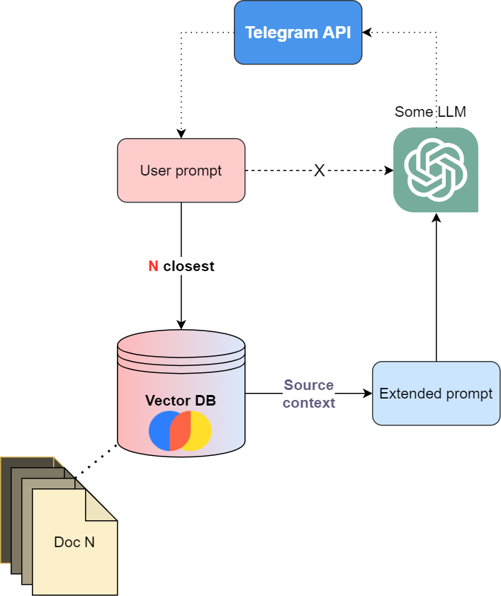
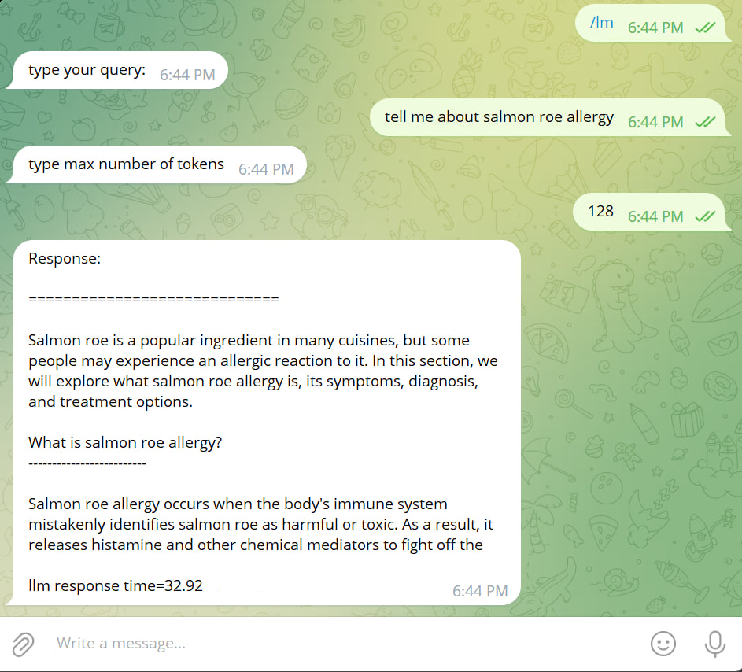
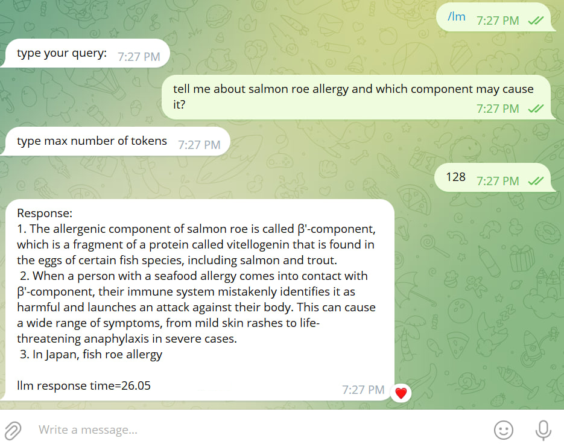

# TgMedBot

## Overview
TgMedBot is a demo Telegram bot project that showcases an interactive ask-and-answer functionality using the Telegram API.
The bot leverages advanced natural language processing techniques to deliver relevant information to users' queries.
It processes user prompts, retrieves similar results from a vector database, and further extends the prompts 
to a language model. The resulting information is streamed back to the user to ensure a smooth experience without freezing.

## How It Works
1. **User Prompt Processing**
2. **Vector Database**: The bot queries a vector database (Chroma) to find similar results related to the identified topics.
3. **Language Model Interaction**: The retrieved results are used to create an extended prompt, which is then passed to the language model (orca-3b 5bit).  
   
   To remove "freezing" LLM output is "streamed" to the chat, updating messages every 3 sec.
4. **Response Generation**: The language model generates a response based on the extended prompt, providing detailed and contextually relevant answers.
5. **User Interaction**: The generated response is sent back to the user via the Telegram API, offering insightful information.

The whole process can be summarized by the schema below:



## Why do you need Vector DB
You may wonder why it's better to use a vector database to provide additional context. 
In that case, just observe the difference in answers:

Using llama2-7b-chat-4bit with NO additional context:



Using orca-3b-5.1bit with additional context:



By the way, it's worth noting that **you have to use an LLM, which implies additional context in its input template.**

## Getting Started

### Prerequisites
- Python 3.x
- Telegram account

If you want to get quick responses you'll need a GPU 
with >=4GB for 3B 4-5bit and >=6GB for 7b 4bit LLM`s

### Collect the data
To populate your own vector database, you can run the scraping pipeline from 
[async_pubmed_scraper](https://github.com/FourierMourier/async_pubmed_scraper)

### Create vector database
Then place your database in `./chroma` folder in the project root using tools/vectordb/create_db.py, for which
you have to create `create_db.yaml` from tools/vectordb/configs/create_db.example.yaml - I used food allergies
```yaml
df_path: path/to/scraped/pubmed/df.parquet
collection_name: your topic name
```

### Download some LLM
Download and place some llm in `ggml bin` format at ./llm_service/models/ - I used [orca-3b 5.1 bit](https://huggingface.co/TheBloke/orca_mini_3B-GGML/tree/main)

Then setup the config in ./llm_service using as example ./llm_service/config.example.yaml

### Create bot config file
Using ./credentials/bot.example.yaml create your own ./credentials/bot.yaml file, using your bot api token

### Run

use 
```shell
docker-compose up -d
```

### Deployment notes

#### Why containerize the application

Due to the fact that chromadb package uses pydantic 1.x whilst aiogram 2.x (at least while I was writing this) you can't have 
them in the same python environment, so it's time for docker. The same goes for LLM service.

Also `tgmedbot` folder became kind of package and due to this 
you can't put main to run bot there (python relative imports)
and you have to put it somewhere outside so for docker container it's better to mount volumes
rather than trying to copy contents of directory one level above.

### Downsides
1. **Slow context expansion.** To be fair, it takes about 2.+ seconds to retrieve additional context from vector database (chroma is used).
2. **Slow response time using CPU only.** llama2-7b 4bpw was able to generate 128 tokens in 33 seconds using 4 threads on intel i7 12gen.
   As the solution you might use exllama2 and process all queries on GPU. 

### Future Improvements
* Allow user to choose topic, which will be related to `collection name` in vector database (chroma is used)
* Add middlewares to filter users (banned/admin etc)
* Consider [exllama2](https://github.com/turboderp/exllamav2) for GPU-using llm_service - 
  I got ~32 tokens per second using 7b llama2-4bit on rtx3070 mobile; 3b ones will be much faster
* Use Redis as FSM storage (additional service is required in this case)
* Use message broker to process queries by LLM (using process pool in fastapi not so good idea)

## License
<!--This project is licensed under the [MIT License](LICENSE). -->
This project is licensed under the Apache License 2.0. See the [LICENSE](LICENSE) file for details.


## Notes
### Model choice 
What I learnt is in some cases it's better to use less quantized model than bigger one with smaller weights size - 
for my tasks Llama-2 7b chat 3-4bit was worse than orca-mini 5.1+bit even without additional context; 
the smaller model was not only more accurate but also significantly faster.
